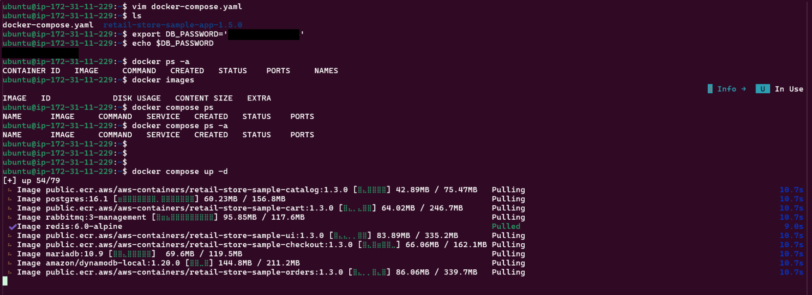

# Day 02 — Docker Compose & Docker Buildx

---

## Section 01: What is Docker Compose and Why It Is Used

Docker Compose is a tool for defining and running **multi-container applications** using a single YAML file. Key benefits:

- Define all services, networking, volumes, and dependencies in one place
- Spin up or tear down all containers with a single command
- Ideal for managing microservice-based applications where multiple containers need to work together

---

## Section 02: Installing Docker Compose & Basic Commands

Verified Docker Compose was already installed on the EC2 instance:

```bash
docker compose version
```


Fetched the sample `docker-compose.yaml` from the retail store app GitHub repository:

```bash
wget https://github.com/aws-containers/retail-store-sample-app/releases/download/v1.5.0/docker-compose.yaml
```

The compose file includes the following services:

| S.No | Service        | Image                                                                 |
|------|----------------|-----------------------------------------------------------------------|
| 1    | cart           | public.ecr.aws/aws-containers/retail-store-sample-cart:1.3.0         |
| 2    | carts-db       | amazon/dynamodb-local:1.20.0                                          |
| 3    | catalog        | public.ecr.aws/aws-containers/retail-store-sample-catalog:1.3.0      |
| 4    | catalog-db     | mariadb:10.9                                                          |
| 5    | checkout       | public.ecr.aws/aws-containers/retail-store-sample-checkout:1.3.0     |
| 6    | checkout-redis | redis:6.0-alpine                                                      |
| 7    | orders         | public.ecr.aws/aws-containers/retail-store-sample-orders:1.3.0       |
| 8    | orders-db      | postgres:16.1                                                         |
| 9    | rabbitmq       | rabbitmq:3-management                                                 |
| 10   | ui             | public.ecr.aws/aws-containers/retail-store-sample-ui:1.3.0           |

Set the database password as an environment variable (used by multiple services):

```bash
export DB_PASSWORD=sample-password
```

Started all containers with a single command:

```bash
docker compose up -d

# If the compose file has a custom name
docker compose -f sample-compose.yaml up -d
```




Validated by accessing the web app and topology page in the browser:
- `http://EC2-IP:3000` — Web application
- `http://EC2-IP:3000/topology` — All services health status


---

## Section 03: Useful Docker Compose Commands

Listed all running containers with detailed info:

```bash
docker compose ps
docker images
```


Stopped a specific service to test impact:

```bash
docker compose stop catalog
```

As soon as the catalog container stopped, `http://EC2-IP:3000/catalog` returned a `500` error and the topology showed the service as unhealthy.


Started the service again and the application returned to normal:

```bash
docker compose start catalog
```


---

## Section 04: Docker Compose Logs & Accessing Container Terminal

Checked logs for all services and a specific service:

```bash
docker compose logs              # all services
docker compose logs checkout     # specific service
docker compose logs -f checkout  # follow real-time logs
```


Tested real-time logs by performing checkout activity in the app while following the logs.


Accessed the terminal of the `ui` container:

```bash
docker compose exec ui /bin/bash
```

Ran the following commands inside the container for exploration:

```bash
ls -ltr
id
uname -mn
env
cat /etc/hostname
cat /etc/os-release
curl http://localhost:8080/actuator/health
curl http://localhost:8080/topology
```


Monitored container resource usage and running processes:

```bash
docker compose stats ui             # real-time resource usage
docker compose stats ui --no-stream # snapshot of last stats
docker compose top ui               # list all running processes inside the container
```


---

## Section 05: Making Changes & Deploying Without Downtime

To test updating a service without affecting others, added an environment variable to the `ui` service in `docker-compose.yaml`:

```yaml
environment:
  - RETAIL_UI_THEME=teal   # changes UI theme from default blue to teal
```

Simply restarting the container did **not** apply the changes. The correct way is to use `--force-recreate`:


```bash
docker compose up -d --force-recreate ui
```


This deletes the existing `ui` container and recreates it with the updated config — without touching other running services.


## Section 06: Cleanup Docker Compose Images and Containers

For cleaning up everything Below commands were used.

```bash
# checking existing resources
docker compase ps -a
docker images

# cleanup commands
docker compose down
docker system prune -a --volumes -f

# validate cleanup
docker compose ps -a
docker images
```


---

## Section 06: Docker Buildx & Multi-Platform Builds


---

## Summary

On Day 02, the focus was on Docker Compose for managing multi-container apps and Docker Buildx for multi-platform image builds.

- Learned what **Docker Compose** is and why it's useful — managing 10 microservices of the retail store app with a single YAML file and one command
- Spun up all services with `docker compose up -d`, validated the web app and service health via the topology page
- Practiced key compose commands — `ps`, `stop`, `start`, `logs`, `exec`, `stats`, and `top` — to monitor, troubleshoot, and interact with running containers
- Learned how to **deploy config changes** to a specific service using `--force-recreate` without affecting other running services, validated by changing the UI theme from blue to teal
- Explored **Docker Buildx** for building multi-platform Docker images
