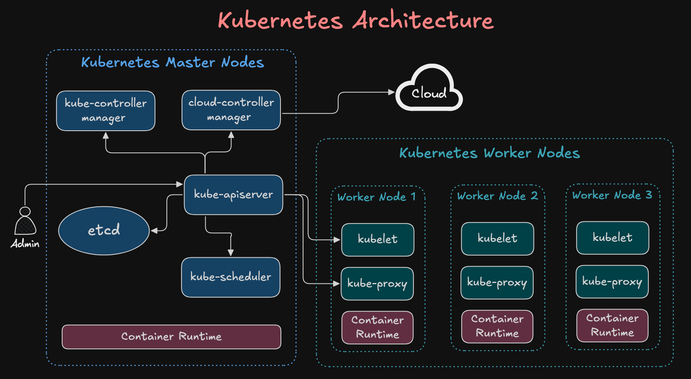
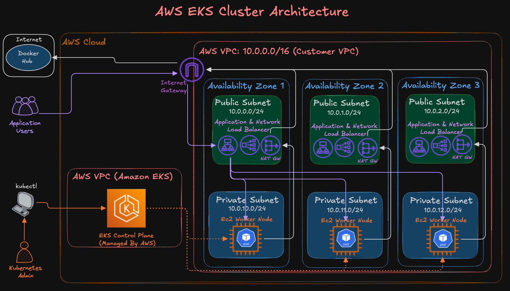
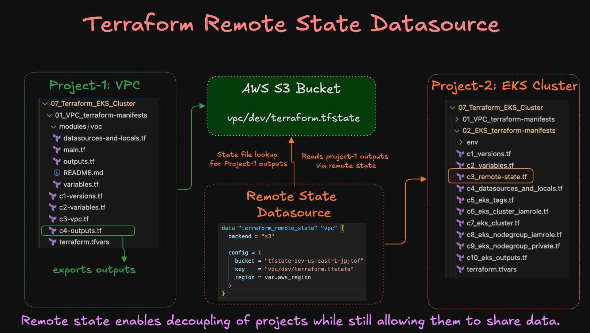

# Day 05 — EKS Cluster Configuration with Terraform (Modular)

## Topic 01: What is Amazon EKS and Why It Is Used

Amazon EKS (Elastic Kubernetes Service) is a **fully managed Kubernetes service** by AWS. It removes the overhead of setting up and maintaining the Kubernetes control plane — AWS handles it. Thus EKS is considered as CaaS (Container as a Service) or PaaS (Platform as a Service) service.

### Question: Why EKS over self-managed Kubernetes?

Running Kubernetes yourself means managing the control plane (API server, etcd, scheduler, controller manager) — that's complex, error-prone, and time-consuming.

EKS solves this by:
- Fully managing the **control plane** — AWS handles upgrades, patching, and availability
- Integrating natively with AWS services — IAM, VPC, ALB, CloudWatch, ECR
- Supporting **managed node groups** — AWS manages EC2 lifecycle for worker nodes
- Providing high availability across multiple AZs out of the box

---
### Course Architecture images





> Terraform Remote State Datasource



---

## Topic 02: EKS Architecture Overview

```
                        ┌─────────────────────────────────┐
                        │        AWS Managed              │
                        │      Control Plane              │
                        │  (API Server, etcd, Scheduler,  │
                        │   Controller Manager)           │
                        └────────────┬────────────────────┘
                                     │ communicates via
                                     │ ENIs in your VPC
                        ┌────────────▼────────────────────┐
                        │           Your VPC              │
                        │  ┌──────────────────────────┐   │
                        │  │     Public Subnet AZ-A   │   │
                        │  │   Worker Node (EC2)      │   │
                        │  └──────────────────────────┘   │
                        │  ┌──────────────────────────┐   │
                        │  │     Public Subnet AZ-B   │   │
                        │  │   Worker Node (EC2)      │   │
                        │  └──────────────────────────┘   │
                        └─────────────────────────────────┘
```

### Key Components

| Component | Description |
|---|---|
| Control Plane | AWS managed — API server, etcd, scheduler, controller manager |
| Node Group | Managed group of EC2 instances (worker nodes) |
| IAM Roles | Separate roles for control plane and node group |
| VPC Config | Subnets and security groups for cluster networking |
| Access Config | Controls how IAM identities authenticate to the cluster |

---

## Topic 03: Modular Terraform Structure

The EKS cluster is provisioned using a **modular Terraform structure** — separating VPC and EKS concerns into their own modules.

**File structure:**
```
Terraform-files/
├── main.tf           # calls vpc and eks modules
├── providers.tf      # terraform block + S3 backend + AWS provider
├── variables.tf      # root input variables
├── outputs.tf        # root outputs from modules
├── terraform.tfvars  # variable values
├── vpc/
│   ├── main.tf       # data sources, subnets, route tables
│   ├── variables.tf  # module input variables
│   └── outputs.tf    # module outputs passed to root/eks module
└── eks/
    ├── eks-cluster.tf          # EKS cluster resource
    ├── eks-cluster-iam-role.tf # IAM role for control plane
    ├── node-groups.tf          # managed node group + SG rule
    ├── node-groups-iam-role.tf # IAM role for worker nodes
    ├── variables.tf            # module input variables
    └── outputs.tf              # module outputs passed to root
```

---

## Topic 04: VPC Module

The VPC module does **not create a new VPC** — it fetches the existing shared bootcamp VPC and IGW using `data` blocks and creates subnets and route tables inside it.

```hcl
# vpc/main.tf (key resources)

data "aws_vpc" "main" {
  tags = { Name = "Bootcamp-vpc-do-not-delete-vpc" }
}

data "aws_internet_gateway" "main" {
  tags = { Name = "Bootcamp-vpc-do-not-delete-igw" }
}

resource "aws_subnet" "pub_sub_1" {
  vpc_id            = data.aws_vpc.main.id
  cidr_block        = var.public_subnet_1_cidr
  availability_zone = "${var.aws_region}a"
  tags              = merge(var.tags, { Name = "Chirag-bootcamp-pub-sub-1" })
}

resource "aws_subnet" "pub_sub_2" {
  vpc_id            = data.aws_vpc.main.id
  cidr_block        = var.public_subnet_2_cidr
  availability_zone = "${var.aws_region}b"
  tags              = merge(var.tags, { Name = "Chirag-bootcamp-pub-sub-2" })
}
```

Two public subnets are created across **two different AZs** — required by EKS for high availability.

---

## Topic 05: EKS Cluster IAM Role

EKS control plane needs an IAM role to manage AWS resources on your behalf — like creating ENIs in your VPC.

```hcl
resource "aws_iam_role" "eks_cluster_role" {
  name = "chirag-eks-cluster-Role"
  assume_role_policy = jsonencode({
    Statement = [{
      Effect    = "Allow"
      Principal = { Service = "eks.amazonaws.com" }
      Action    = "sts:AssumeRole"
    }]
  })
}
```

Two policies are attached to this role:

| Policy | Purpose |
|---|---|
| `AmazonEKSClusterPolicy` | Core permissions for EKS control plane |
| `AmazonEKSVPCResourceController` | Allows EKS to manage VPC resources like ENIs and security groups |

---

## Topic 06: EKS Cluster Resource

```hcl
resource "aws_eks_cluster" "eks_cluster" {
  name     = "chirag-eks-cluster"
  role_arn = aws_iam_role.eks_cluster_role.arn
  version  = var.eks_version

  vpc_config {
    subnet_ids              = var.public_subnet_ids
    endpoint_public_access  = true
    endpoint_private_access = true
    public_access_cidrs     = [var.my_ip_cidr]  # restricts API server access to your IP
  }

  enabled_cluster_log_types = ["api", "audit", "authenticator", "controllerManager", "scheduler"]

  access_config {
    authentication_mode                         = "API_AND_CONFIG_MAP"
    bootstrap_cluster_creator_admin_permissions = true
  }

  kubernetes_network_config {
    service_ipv4_cidr = var.service_ipv4_cidr
  }
}
```

### Key Configurations Explained

**`vpc_config`**

| Attribute | Value | Purpose |
|---|---|---|
| `endpoint_public_access` | `true` | Allows `kubectl` access from only one location |
| `endpoint_private_access` | `true` | Nodes communicate with API server privately within VPC |
| `public_access_cidrs` | `my_ip_cidr` | Restricts public API access to my IP only |

**`enabled_cluster_log_types`** — All 5 control plane log types are enabled and sent to CloudWatch:

| Log Type | Purpose |
|---|---|
| `api` | Every API call made to the cluster |
| `audit` | Security-relevant requests — who did what |
| `authenticator` | IAM authentication attempts |
| `controllerManager` | Pod scheduling and replication events |
| `scheduler` | Which node a pod was assigned to and why |


**`access_config`**

| Attribute | Value | Purpose |
|---|---|---|
| `authentication_mode` | `API_AND_CONFIG_MAP` | Supports both new Access Entries API and old `aws-auth` ConfigMap |
| `bootstrap_cluster_creator_admin_permissions` | `true` | Automatically grants cluster admin to the IAM identity that creates the cluster |

**`kubernetes_network_config`**
- `service_ipv4_cidr` — CIDR block from which Kubernetes assigns ClusterIP addresses to Services. Set to `172.20.0.0/24`. Cannot be changed after cluster creation.

---

## Topic 07: Node Group IAM Role

Worker nodes need their own IAM role to interact with AWS services — pulling images from ECR, attaching ENIs via the CNI plugin, etc.

```hcl
resource "aws_iam_role" "node_group_role" {
  name = "chirag-eks-node-group-Role"
  assume_role_policy = jsonencode({
    Statement = [{
      Effect    = "Allow"
      Principal = { Service = "ec2.amazonaws.com" }
      Action    = "sts:AssumeRole"
    }]
  })
}
```

Three policies are attached to the node group role:

| Policy | Purpose |
|---|---|
| `AmazonEKSWorkerNodePolicy` | Core permissions for worker nodes to join the cluster |
| `AmazonEKS_CNI_Policy` | Allows the VPC CNI plugin to manage ENIs for pod networking |
| `AmazonEC2ContainerRegistryReadOnly` | Allows nodes to pull images from ECR |

---

## Topic 08: Managed Node Group

```hcl
resource "aws_eks_node_group" "node-group" {
  cluster_name    = aws_eks_cluster.eks_cluster.name
  node_group_name = "chirag-bootcamp-node-group"
  node_role_arn   = aws_iam_role.node_group_role.arn
  subnet_ids      = var.public_subnet_ids

  scaling_config {
    desired_size = 2
    max_size     = 3
    min_size     = 1
  }

  instance_types       = var.node_group_instance_type
  ami_type             = "AL2023_x86_64_STANDARD"
  disk_size            = var.node_disk_size
  capacity_type        = "ON_DEMAND"
  force_update_version = true

  update_config {
    max_unavailable_percentage = 33
  }
}
```

### Node Group Configuration Explained

| Attribute | Value | Purpose |
|---|---|---|
| `desired_size` | `2` | 2 EC2 instances running at all times |
| `max_size` | `3` | Can scale up to 3 during high load |
| `min_size` | `1` | Will never go below 1 instance |
| `ami_type` | `AL2023_x86_64_STANDARD` | Amazon Linux 2023 — latest recommended AMI for EKS |
| `capacity_type` | `ON_DEMAND` | Uses regular on-demand EC2 instances |
| `force_update_version` | `true` | Forces node update even if PodDisruptionBudget is not satisfied |
| `max_unavailable_percentage` | `33` | During updates, max 33% of nodes can be unavailable at a time |

### Security Group for NodePort

EKS auto-creates a cluster security group and attaches it to all nodes. A custom rule is added to restrict NodePort access to only your IP:

```hcl
resource "aws_security_group_rule" "node_group_sg" {
  type              = "ingress"
  from_port         = 30000
  to_port           = 32767
  protocol          = "tcp"
  security_group_id = aws_eks_cluster.eks_cluster.vpc_config[0].cluster_security_group_id
  cidr_blocks       = [var.my_ip_cidr]
}
```

> NodePort range `30000-32767` is restricted to `my_ip_cidr` instead of `0.0.0.0/0` to avoid unnecessary security alerts in the organisation's AWS account.

---

## Topic 09: How Module Outputs Flow

```
vpc/outputs.tf
      │  vpc_id, public_subnet_1_id, public_subnet_2_id
      ▼
root main.tf  →  module.vpc.public_subnet_1_id
      │
      ▼
eks/variables.tf  →  var.public_subnet_ids

eks/outputs.tf
      │  eks-cluster-name, eks-cluster-endpoint, etc.
      ▼
root outputs.tf  →  module.eks_cluster.eks-cluster-name
```

---

## Topic 10: Provisioning Commands

```bash
# Initialize — downloads provider and sets up S3 backend
terraform init

# Validate syntax
terraform validate

# Preview changes
terraform plan

# Apply — takes ~10-15 minutes (EKS control plane takes 8-10 min alone)
terraform apply -auto-approve

# After apply — configure kubectl using the output command
aws eks update-kubeconfig --region ap-south-1 --name chirag-eks-cluster

# Verify nodes are ready
kubectl get nodes

# See everything across all namespaces
kubectl get all -A

# List all resources in Terraform state (including module resources)
terraform state list

# Destroy all resources
terraform destroy -auto-approve
```

---

## Topic 11: Deploying Sample Retail Store App (Basic Test)

To verify the cluster is working, deployed the `ui` service from the retail store app (same app used in Day-02 with Docker Compose):

```yaml
apiVersion: apps/v1
kind: Deployment
metadata:
  name: retail-ui
spec:
  replicas: 1
  selector:
    matchLabels:
      app: retail-ui
  template:
    metadata:
      labels:
        app: retail-ui
    spec:
      containers:
        - name: retail-ui
          image: public.ecr.aws/aws-containers/retail-store-sample-ui:1.3.0
          ports:
            - containerPort: 8080

---
apiVersion: v1
kind: Service
metadata:
  name: retail-ui-svc
spec:
  type: NodePort
  selector:
    app: retail-ui
  ports:
    - port: 80
      targetPort: 8080
      nodePort: 30007
```

```bash
kubectl apply -f k8s-manifests/demo-app.yaml
kubectl get pods
kubectl get all
```

Access via: `http://EC2-Public-IP:30007`

---

## Summary

Day 05 focused on provisioning a production-grade EKS cluster on AWS using modular Terraform.

- Understood **EKS architecture** — how the AWS managed control plane communicates with worker nodes in your VPC via ENIs
- Created a **modular Terraform structure** with separate `vpc` and `eks` modules — each with their own `main.tf`, `variables.tf`, and `outputs.tf`
- Configured the **EKS cluster** with restricted API access, all 5 control plane log types enabled, and both public and private endpoint access
- Set up **IAM roles** separately for the control plane (`eks.amazonaws.com`) and worker nodes (`ec2.amazonaws.com`) with the correct managed policies
- Created a **managed node group** with auto-scaling config, AL2023 AMI, and a rolling update strategy
- Restricted **NodePort access** to personal IP using the cluster's auto-created security group instead of leaving it open to `0.0.0.0/0`
- Understood `bootstrap_cluster_creator_admin_permissions` and how to grant additional IAM identities cluster access using EKS Access Entries
- Deployed the **retail store UI** as a basic smoke test to verify the cluster is functional
