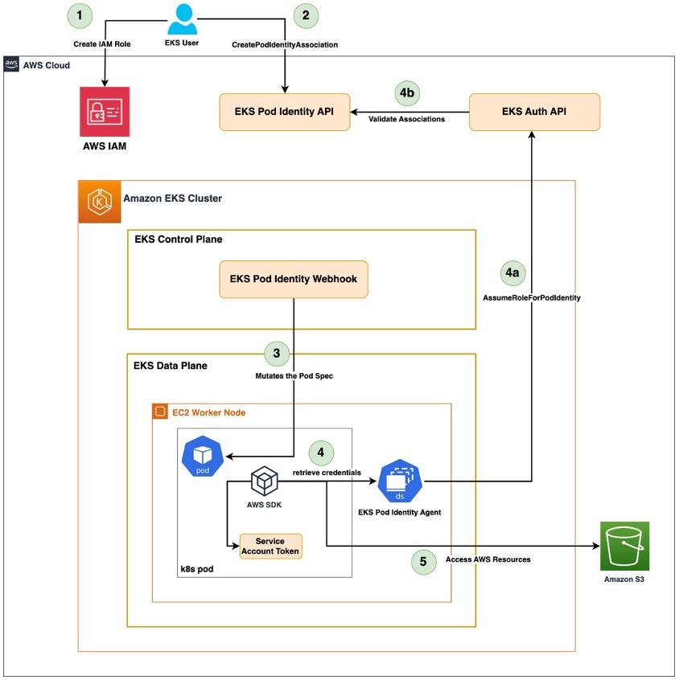
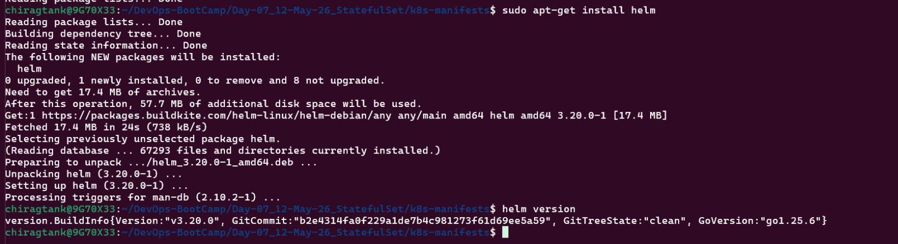

# Day 08 — Kubernetes Secrets, CSI Driver, ASCP & Pod Identity Agent

### Course Architecture images

> Amazon EKS Pod Identity - High Level Flow




> AWS Secret Manager Architecture


----

## Topic 01: Kubernetes Secrets

Kubernetes Secrets are stored in **etcd** with **Base64 encoding** — this is not encryption, just encoding, and can be easily decoded to retrieve the actual value. Secrets are created similarly to a ConfigMap with key-value pairs, the only difference being that values are Base64 encoded.

```bash
# Encode
echo -n "my-password" | base64

# Decode
echo -n "bXktcGFzc3dvcmQ=" | base64 --decode
```

> **Important:** Always use `echo -n` (no trailing newline) when encoding secret values. Using `echo` without `-n` appends a newline character to the encoded value, which causes authentication failures when the secret is consumed by an application.

### Why Kubernetes Secrets Are Not Best Practice for Production

Kubernetes Secrets are not suitable for production clusters because anyone with cluster access can retrieve and decode them trivially. While RBAC can restrict access to specific users, the general best practice is to **not store secrets in the cluster at all** — instead, use **AWS Secrets Manager** and fetch secrets at runtime.

---

## Topic 02: AWS Secrets Manager Integration — How It Works

To fetch secrets from AWS Secrets Manager into Kubernetes pods, the following components need to be set up:


### Components Involved

| Component | What it does |
|---|---|
| **Pod Identity Agent (PIA)** | Authenticates and authorises requests from pods to AWS services |
| **CSI Secrets Store Driver** | Fetches secrets from AWS Secrets Manager and mounts them as volumes in pods |
| **ASCP (AWS Secrets and Config Provider)** | DaemonSet that calls AWS Secrets Manager and passes secret data to the CSI driver |
| **SecretProviderClass** | Kubernetes resource that defines which secret to fetch from AWS Secrets Manager and how to expose it |
| **Kubernetes Service Account** | Linked to an IAM role via Pod Identity Association to grant pods the required AWS permissions |

---

## Topic 03: Pod Identity Agent (PIA)

The **Pod Identity Agent** is a Kubernetes add-on that handles authentication and authorisation for pods to access AWS services. It replaces the older approaches of using node-level IAM roles or IRSA (IAM Roles for Service Accounts).

### Setup Steps

1. Install the **EKS Pod Identity Agent** add-on on the cluster
2. Create an **IAM role** with:
   - A trust policy that allows `pods.eks.amazonaws.com` to assume the role
   - Permission policies for the AWS services the pods need (e.g. `secretsmanager:GetSecretValue`)
3. Create a **Pod Identity Association** — links the IAM role to a specific Kubernetes Service Account in a specific namespace

Only pods using that specific Service Account in that namespace can assume the IAM role and access AWS Secrets Manager.

---

## Topic 04: CSI Secrets Store Driver & ASCP

### CSI Secrets Store Driver

The **Secrets Store CSI Driver** is a Kubernetes add-on that bridges Kubernetes and external secret stores (like AWS Secrets Manager), fetching secrets and mounting them as volumes or environment variables inside pods.

### ASCP (AWS Secrets and Config Provider)

The **ASCP** runs as a **DaemonSet** on every node. It is the AWS-specific provider for the CSI driver. When a pod requests a secret:

1. The CSI driver calls the ASCP
2. ASCP authenticates via the Pod Identity Agent and the associated IAM role
3. ASCP fetches the secret from AWS Secrets Manager
4. The CSI driver mounts the secret into the pod as a volume or environment variable

### SecretProviderClass

The `SecretProviderClass` is a Kubernetes custom resource that tells the CSI driver which secret to fetch, which provider to use, and how to expose it inside the pod:

```yaml
apiVersion: secrets-store.csi.x-k8s.io/v1
kind: SecretProviderClass
metadata:
  name: catalog-db-secrets
spec:
  provider: aws
  parameters:
    objects: |
      - objectName: "chirag-catalog-db-secret-1"
        objectType: "secretsmanager"
        jmesPath:
          - path: "MYSQL_USER"
            objectAlias: "MYSQL_USER"
          - path: "MYSQL_PASSWORD"
            objectAlias: "MYSQL_PASSWORD"
    usePodIdentity: "true"
```

---

## Topic 05: End-to-End Flow Summary

```
1. Pod starts and uses a ServiceAccount linked to an IAM role via PIA
2. Pod mounts a volume using the CSI Secrets Store Driver
3. CSI driver calls ASCP (DaemonSet on the node)
4. ASCP authenticates to AWS using the Pod Identity Agent + IAM role
5. ASCP fetches the secret from AWS Secrets Manager
6. CSI driver mounts the secret into the pod's volume or env var
7. Application reads the secret from the mounted path
```

---

## Lab Implementation

### 1. Provision EKS Cluster (Terraform)

Provisioned the EKS cluster using Terraform and configured kubectl access:

```bash
terraform init
terraform validate
terraform plan
terraform apply -auto-approve
terraform output
```

```bash
aws eks update-kubeconfig --region ap-south-1 --name chirag-eks-cluster
kubectl get nodes
```


---

### 2. Deploy Initial K8s Manifests (Basic Secrets)

With cluster access confirmed, deployed the Kubernetes manifests one by one using plain Kubernetes Secrets to validate the base application setup before integrating AWS Secrets Manager:

```bash
kubectl apply -f secrets.yaml
kubectl apply -f catalog-config.yaml
kubectl apply -f services.yaml
kubectl apply -f statefulset.yaml
kubectl apply -f deployment.yaml

kubectl get all,cm,secret
```


Once all pods were in `Running` state, validated the application using port-forwarding:

```bash
kubectl port-forward service/catalog-service 3000:8080
```

- `http://localhost:3000/health`
- `http://localhost:3000/catalog/products`
- `http://localhost:3000/topology`


Also validated direct MySQL access by running a temporary client pod:

```bash
kubectl run -it --rm mysql-client --image=mysql:8.0 -- mysql -h mysql -u mysql_user -p

show databases;
use catalogdb;
show tables;
select * from tags;
exit
```


With the base setup confirmed, the next step was to replace plain Kubernetes Secrets with AWS Secrets Manager — the production-safe approach.

---

### 3. Install Helm & Add Repositories

The CSI Secrets Store Driver and ASCP are installed via Helm. First, installed Helm:

```bash
curl -fsSL https://packages.buildkite.com/helm-linux/helm-debian/gpgkey | gpg --dearmor | sudo tee /usr/share/keyrings/helm.gpg > /dev/null
echo "deb [signed-by=/usr/share/keyrings/helm.gpg] https://packages.buildkite.com/helm-linux/helm-debian/any/ any main" | sudo tee /etc/apt/sources.list.d/helm-stable-debian.list

sudo apt-get update
sudo apt-get install helm

helm version
```



Then added the required Helm repositories:

```bash
helm repo add secrets-store-csi-driver https://kubernetes-sigs.github.io/secrets-store-csi-driver/charts
helm repo add aws-secrets-manager https://aws.github.io/secrets-store-csi-driver-provider-aws
helm repo update

helm repo list
```


---

### 4. Install CSI Secrets Store Driver & ASCP

Installed the core CSI Secrets Store Driver:

```bash
helm install csi-secrets-store \
  secrets-store-csi-driver/secrets-store-csi-driver \
  --namespace kube-system \
  --set tokenRequests[0].audience="pods.eks.amazonaws.com"

# Verify installation
helm list --all-namespaces
helm status csi-secrets-store -n kube-system
kubectl get pods -n kube-system -l app=secrets-store-csi-driver
```


Validated all installed components:

```bash
# CSI driver pods
kubectl get pods -n kube-system -l app=secrets-store-csi-driver

# ASCP pods
kubectl get pods -n kube-system -l app=secrets-store-csi-driver-provider-aws

# All resources from both releases
kubectl get all,sa,cm,ds,deploy,pod -n kube-system -l "app.kubernetes.io/instance=secrets-provider-aws"
```


---

### 5. Create IAM Policy, Role & Pod Identity Agent

Exported environment variables used across multiple commands:

```bash
export AWS_REGION="ap-south-1"
export EKS_CLUSTER_NAME="chirag-eks-cluster"
export AWS_ACCOUNT_ID=$(aws sts get-caller-identity --query Account --output text)

echo $AWS_REGION
echo $EKS_CLUSTER_NAME
echo $AWS_ACCOUNT_ID
```

Created the IAM policy that grants access to the secret in AWS Secrets Manager:

```bash
cat <<EOF > chirag-catalog-db-secret-policy.json
{
  "Version": "2012-10-17",
  "Statement": [
    {
      "Effect": "Allow",
      "Action": [
        "secretsmanager:GetSecretValue",
        "secretsmanager:DescribeSecret"
      ],
      "Resource": "arn:aws:secretsmanager:${AWS_REGION}:${AWS_ACCOUNT_ID}:secret:catalog-db-secret*"
    }
  ]
}
EOF

aws iam create-policy \
  --policy-name chirag-catalog-db-secret-policy \
  --policy-document file://chirag-catalog-db-secret-policy.json
```


Created the IAM role with a trust policy that allows EKS pods to assume it via the Pod Identity Agent:

```bash
cat <<EOF > trust-policy.json
{
  "Version": "2012-10-17",
  "Statement": [
    {
      "Effect": "Allow",
      "Principal": {
        "Service": "pods.eks.amazonaws.com"
      },
      "Action": [
        "sts:AssumeRole",
        "sts:TagSession"
      ]
    }
  ]
}
EOF

aws iam create-role \
  --role-name chirag-catalog-db-secrets-role \
  --assume-role-policy-document file://trust-policy.json

aws iam attach-role-policy \
  --role-name chirag-catalog-db-secrets-role \
  --policy-arn arn:aws:iam::${AWS_ACCOUNT_ID}:policy/chirag-catalog-db-secret-policy
```


Installed the EKS Pod Identity Agent add-on:

```bash
aws eks create-addon \
  --cluster-name chirag-eks-cluster \
  --addon-name eks-pod-identity-agent
```

Verified the add-on and DaemonSet were running:

```bash
aws eks list-addons --cluster-name chirag-eks-cluster
kubectl get daemonset -n kube-system
kubectl get pods -n kube-system
```

Created the Pod Identity Association to link the IAM role to the Kubernetes Service Account:

```bash
aws eks create-pod-identity-association \
  --cluster-name ${EKS_CLUSTER_NAME} \
  --namespace default \
  --service-account catalog-mysql-sa \
  --role-arn arn:aws:iam::${AWS_ACCOUNT_ID}:role/chirag-catalog-db-secrets-role

aws eks list-pod-identity-associations --cluster-name ${EKS_CLUSTER_NAME}
```


---

### 6. Create Secret in AWS Secrets Manager

Created the secret that the application will consume at runtime:

```bash
aws secretsmanager create-secret \
  --name chirag-catalog-db-secret-1 \
  --region $AWS_REGION \
  --description "MySQL credentials for Catalog microservice" \
  --secret-string '{
      "MYSQL_USER": "mysql_user",
      "MYSQL_PASSWORD": "your-password"
  }'

# Verify the secret was created
aws secretsmanager list-secrets \
  --region $AWS_REGION \
  --query "SecretList[?contains(Name, 'chirag-catalog-db-secret-1')].[Name,ARN]" \
  --output table

# Describe the secret
aws secretsmanager describe-secret \
  --secret-id chirag-catalog-db-secret-1 \
  --region $AWS_REGION

# Retrieve the value (for testing only)
aws secretsmanager get-secret-value \
  --secret-id chirag-catalog-db-secret-1 \
  --region $AWS_REGION \
  --query SecretString --output text
```


---

### 7. Deploy K8s Manifests (AWS Secrets Manager Integration)

Deployed the updated manifests that use the CSI driver and AWS Secrets Manager instead of plain Kubernetes Secrets:

```bash
kubectl apply -f secret-provider-class.yaml
kubectl apply -f service-account.yaml
kubectl apply -f catalog-config.yaml
kubectl apply -f services.yaml
kubectl apply -f statefulset.yaml
kubectl apply -f deployment.yaml
```

Validated all resources were running:

```bash
kubectl get all,secretproviderclass,cm,sa
```


---

### 8. Validate Secret Mounting

Verified the secrets were successfully fetched from AWS Secrets Manager and mounted inside the pods:

```bash
# MySQL Pod
kubectl exec -it <mysql-pod-name> -- ls /mnt/secrets-store
kubectl exec -it <mysql-pod-name> -- cat /mnt/secrets-store/MYSQL_USER
kubectl exec -it <mysql-pod-name> -- cat /mnt/secrets-store/MYSQL_PASSWORD

# Catalog Pod
kubectl exec -it <catalog-pod-name> -- ls /mnt/secrets-store
kubectl exec -it <catalog-pod-name> -- cat /mnt/secrets-store/MYSQL_USER
kubectl exec -it <catalog-pod-name> -- cat /mnt/secrets-store/MYSQL_PASSWORD
```


---

### 9. Cleanup

Deleted all Kubernetes resources and destroyed the cluster:

```bash
kubectl delete -f deployment.yaml
kubectl delete -f statefulset.yaml
kubectl delete -f services.yaml
kubectl delete -f secret-provider-class.yaml
kubectl delete -f service-account.yaml

terraform destroy -auto-approve
```


---

## Summary

Day 08 focused on securely managing secrets in Kubernetes by integrating AWS Secrets Manager using the CSI Secrets Store Driver, ASCP, and Pod Identity Agent.

- **Kubernetes Secrets are not production-safe** — they are only Base64 encoded (not encrypted), and anyone with cluster access can decode them; the best practice is to use AWS Secrets Manager instead
- **Pod Identity Agent (PIA)** — a Kubernetes add-on that authenticates pods to AWS services by linking a Kubernetes Service Account to an IAM role via a Pod Identity Association, scoped to a specific namespace
- **CSI Secrets Store Driver** — bridges Kubernetes and external secret stores, fetching secrets and mounting them as volumes or environment variables inside pods
- **ASCP (AWS Secrets and Config Provider)** — a DaemonSet that runs on every node and acts as the AWS-specific provider for the CSI driver, handling the actual API calls to AWS Secrets Manager
- **SecretProviderClass** — the Kubernetes custom resource that defines which secret to fetch, from which provider, and how to expose it inside the pod
- **End-to-end flow** — pod starts → CSI driver calls ASCP → ASCP authenticates via PIA + IAM role → fetches secret from AWS Secrets Manager → secret mounted into pod
