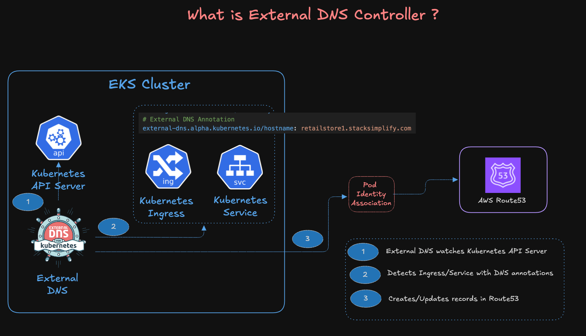
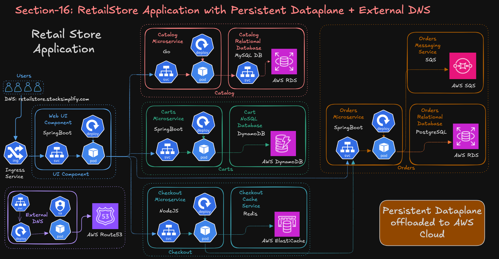

# Day 14 — ExternalDNS on EKS

### Course Architecture Images

> AWS EKS with External DNS Architecture





----
## Topic 01: What is ExternalDNS?

**ExternalDNS** is a Kubernetes controller that watches Ingress and Service resources and automatically creates, updates, and deletes DNS records in external DNS providers like AWS Route53, based on annotations defined on those resources.

Without ExternalDNS, every time you deploy an Ingress you have to manually go into Route53 and create an A record pointing your domain to the ALB DNS name. ExternalDNS eliminates that entirely — it watches the cluster and syncs DNS records automatically.

### Key Behaviours

- **Automatic creation** — DNS records are created as soon as an annotated Ingress is deployed
- **Automatic updates** — If the ALB DNS name changes, ExternalDNS updates the Route53 record accordingly
- **Automatic deletion** — DNS records are removed when the Ingress is deleted, no manual cleanup needed
- **Ownership tracking** — ExternalDNS creates a TXT record alongside each A record to track which records it manages, preventing it from accidentally modifying records it didn't create

### End-to-End Flow

```
1. Ingress deployed with annotation: external-dns.alpha.kubernetes.io/hostname: myapp.yourdomain.com
2. AWS Load Balancer Controller creates an ALB and assigns it a DNS name
3. ExternalDNS detects the hostname annotation on the Ingress
4. ExternalDNS calls the Route53 API (via its Pod Identity IAM role) to create:
   - An A record (alias): myapp.yourdomain.com → ALB DNS name
   - A TXT record for ownership tracking
5. DNS propagates — users reach the app via the custom domain
6. When the Ingress is deleted, ExternalDNS automatically removes the Route53 records
```

---

## Topic 02: ExternalDNS as an EKS Add-On

ExternalDNS can be installed as a managed **EKS Add-On**, which means AWS handles the lifecycle (install, upgrade, patching) rather than you managing it manually via Helm.

It runs in its own dedicated `external-dns` namespace — unlike the AWS Load Balancer Controller and EBS CSI Driver which live in `kube-system`.

### IAM Permissions

ExternalDNS needs permission to manage Route53 records. This is granted by:
- Creating an IAM role with the `AmazonRoute53FullAccess` managed policy
- Creating a **Pod Identity Association** to bind the IAM role to the `external-dns` ServiceAccount in the `external-dns` namespace

### Terraform Setup (3 files)

The ExternalDNS setup requires Terraform file External-dns.tf on top of the existing EKS cluster configuration:

- It creates the IAM role and attaches the `AmazonRoute53FullAccess` managed policy using the shared Pod Identity trust policy
- Also creates the Pod Identity Association linking the IAM role to the `external-dns` ServiceAccount in the `external-dns` namespace
- Installs ExternalDNS as a managed EKS add-on using the latest compatible version, with `depends_on` ensuring the Pod Identity Agent and node group are ready first

---

## Topic 03: Ingress Annotations for ExternalDNS

ExternalDNS is triggered by a single annotation on the Ingress resource:

```
external-dns.alpha.kubernetes.io/hostname: myapp.yourdomain.com
```

This annotation tells ExternalDNS which domain name to register in Route53 for that Ingress. It works alongside the existing ALB Controller annotations — both controllers watch the same Ingress object independently and each performs their own action (ALB Controller provisions the load balancer, ExternalDNS creates the DNS record).

For **HTTPS Ingress**, the same ExternalDNS annotation is used alongside the ACM certificate ARN annotation and the SSL redirect annotation. ExternalDNS only cares about the hostname annotation — the SSL configuration is handled entirely by the ALB Controller.

---

## Topic 04: ACM SSL Certificate

For HTTPS Ingress, an **AWS Certificate Manager (ACM)** certificate is required. ACM provides free public certificates with automatic renewal.

The certificate ARN is referenced in the `alb.ingress.kubernetes.io/certificate-arn` annotation on the Ingress. The ALB Controller reads this annotation and configures the ALB HTTPS listener with the certificate. ExternalDNS and ACM operate independently — ExternalDNS handles the DNS record, ACM handles the TLS termination at the ALB.

### Certificate Types

| Type | Validation | Use Case |
|---|---|---|
| **Domain Validated (DV)** | CA verifies domain ownership | General web apps |
| **Organization Validated (OV)** | CA verifies company details | Business sites |
| **Extended Validation (EV)** | Deep CA verification | Financial/banking |
| **Self-Signed** | No CA involved | Not trusted by browsers |

---

## Topic 05: Full Add-On Stack

ExternalDNS is added on top of the existing EKS add-on stack from previous days:

| Add-On | Install Type | Namespace | Purpose |
|---|---|---|---|
| **Pod Identity Agent** | EKS Add-On | `kube-system` | Enables pods to assume IAM roles securely |
| **AWS Load Balancer Controller** | Helm | `kube-system` | Manages ALBs/NLBs for Ingress resources |
| **EBS CSI Driver** | EKS Add-On | `kube-system` | Dynamic EBS volume provisioning |
| **Secrets Store CSI + ASCP** | Helm | `kube-system` | Mounts Secrets Manager secrets into pods |
| **ExternalDNS** | EKS Add-On | `external-dns` | Auto-creates/updates/deletes Route53 DNS records |

---

## Topic 07: Prerequisites for ExternalDNS

ExternalDNS requires a **Route53 Hosted Zone** to function. A hosted zone is a container in Route53 that holds DNS records for a specific domain. ExternalDNS needs to know which hosted zone to write records into, and it needs the IAM permissions to do so.

If you don't own a domain, ExternalDNS cannot create DNS records — the Ingress and ALB will still work and be accessible via the raw ALB DNS name, but the custom domain mapping won't happen.

---

## Summary

Day 14 focused on automating DNS management for Kubernetes applications using ExternalDNS on EKS.

- **ExternalDNS** — A Kubernetes controller that watches Ingress/Service annotations and automatically creates, updates, and deletes Route53 DNS records; eliminates all manual DNS management
- **EKS Add-On install** — ExternalDNS runs in its own `external-dns` namespace as a managed EKS add-on; AWS handles lifecycle and upgrades
- **Pod Identity Association** — Binds the IAM role (with `AmazonRoute53FullAccess`) to the `external-dns` ServiceAccount so the controller can call Route53 APIs
- **`external-dns.alpha.kubernetes.io/hostname` annotation** — The single annotation on an Ingress that triggers ExternalDNS to create an A record (alias to the ALB) and a TXT ownership record in Route53
- **HTTPS with ACM** — ACM provides free, auto-renewing public certificates; the certificate ARN is referenced in the ALB Controller annotation while ExternalDNS handles the DNS record independently
- **Automatic cleanup** — When an Ingress is deleted, ExternalDNS automatically removes the corresponding Route53 records
