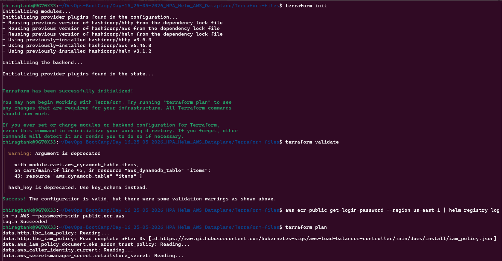

# Day 17 — Observability with OpenTelemetry (ADOT) on EKS

## Topic 01: OpenTelemetry and ADOT Architecture

**OpenTelemetry (OTEL)** is a vendor-neutral observability framework for collecting traces, metrics, and logs. **AWS Distro for OpenTelemetry (ADOT)** is AWS's supported distribution, installed as an EKS add-on that deploys the ADOT Operator into the cluster.

```
Retail Apps (instrumented)
        ↓  OTLP (HTTP :4318 / gRPC :4317)
ADOT Collector (OpenTelemetryCollector CR)
        ↓
  ┌─────┴──────┐
X-Ray       CloudWatch / AMP
```

### Key Components

- **ADOT Operator** — Kubernetes operator installed via EKS add-on; manages `OpenTelemetryCollector` and `Instrumentation` CRDs; requires cert-manager as a prerequisite
- **OpenTelemetryCollector** — defines a collector pipeline: receivers → processors → exporters
- **Instrumentation** — injects OTEL SDK env vars into pods at startup via a mutating webhook; no application code changes needed
- **Pod Identity** — ADOT collector pod assumes an IAM role via EKS Pod Identity to write to X-Ray, CloudWatch, and AMP — no credentials stored in the pod

### IAM Permissions for ADOT Collector

| Permission | Purpose |
|---|---|
| `xray:PutTraceSegments`, `xray:PutTelemetryRecords` | Send traces to X-Ray |
| `xray:GetSamplingRules`, `xray:GetSamplingTargets` | Fetch X-Ray sampling config |
| `logs:PutLogEvents`, `logs:CreateLogGroup/Stream` | Write logs to CloudWatch |
| `cloudwatch:PutMetricData` | Push custom metrics |
| `aps:RemoteWrite`, `aps:QueryMetrics` | Write/read metrics from AMP |

---

## Topic 02: ADOT Collector Pipeline

The `OpenTelemetryCollector` CR (`01_adot_collector_traces.yaml`) defines a pipeline with three stages:

```
receivers → processors → exporters
```

| Stage | Component | Purpose |
|---|---|---|
| Receiver | `otlp` (gRPC :4317, HTTP :4318) | Accept traces from apps |
| Processor | `memory_limiter` | Prevent OOM — limit 512 MiB, spike 128 MiB |
| Processor | `filter/healthcheck` | Drop health check & probe spans early |
| Processor | `k8sattributes` | Enrich spans with pod/namespace/node metadata |
| Processor | `batch` | Buffer spans — send every 10s or 50 spans |
| Exporter | `awsxray` | Send to AWS X-Ray with indexed K8s attributes |

Processor order matters — health checks are dropped before `k8sattributes` runs, so no wasted K8s API lookups on noise spans.

### Health Check Filtering

Spans are dropped when they match any of these conditions:

```yaml
filter/healthcheck:
  traces:
    span:
      - 'attributes["http.route"] == "/actuator/health/{*path}"'      # Spring Boot
      - 'attributes["user_agent.original"] == "ELB-HealthChecker/2.0"'
      - 'IsMatch(attributes["user_agent.original"], "^kube-probe/.*")'
      - 'attributes["url.path"] == "/health"'                          # Node.js
      - 'attributes["nestjs.callback"] == "health"'
      - 'attributes["express.name"] == "/health" and attributes["express.type"] == "request_handler"'
```

---

## Topic 03: Instrumentation CR

The `Instrumentation` CR (`02_adot_instrumentation_traces.yaml`) injects OTEL SDK configuration into pods via environment variables — no code changes needed. The retail store apps already contain manual instrumentation; this CR only provides the runtime SDK config.

```yaml
exporter:
  endpoint: http://adot-traces-collector:4318

propagators:
  - tracecontext
  - baggage

sampler:
  type: always_on
```

Key env vars injected into every pod:

| Variable | Value | Purpose |
|---|---|---|
| `OTEL_EXPORTER_OTLP_PROTOCOL` | `http/protobuf` | Wire format |
| `OTEL_TRACES_EXPORTER` | `otlp` | Enable trace export |
| `OTEL_METRICS_EXPORTER` | `none` | Disabled — traces only in this lab |
| `OTEL_LOGS_EXPORTER` | `none` | Disabled |
| `OTEL_RESOURCE_PROVIDERS_AWS_ENABLED` | `true` | Auto-detect EKS/EC2 resource attributes |

---

## Topic 04: Terraform Project Structure

Day 17 uses a single Terraform project that provisions everything — EKS, Karpenter, all add-ons, the full AWS data plane, and the observability stack:

```
Terraform-files/
├── vpc/                    # Subnets in existing VPC
├── eks/                    # EKS cluster, node group, add-ons (LBC, EBS CSI, Metrics Server)
├── iam/                    # IAM roles — cluster, node group, LBC, EBS CSI, Karpenter
├── catalog/                # RDS MySQL + IAM role + Pod Identity Association
├── cart/                   # DynamoDB table + IAM role + Pod Identity Association
├── checkout/               # ElastiCache Redis cluster + security group
├── orders/                 # RDS PostgreSQL + SQS queue + IAM role + Pod Identity Association
├── observability/
│   ├── amp/                # Amazon Managed Prometheus workspace
│   ├── amg/                # Amazon Managed Grafana workspace (SSO auth, AMP + CW + X-Ray data sources)
│   └── iam/                # ADOT collector IAM role + Pod Identity Association; AMG IAM role
├── main.tf
├── data.tf
├── helm-install.tf         # LBC, CSI Driver, ASCP, Karpenter Helm releases
├── observability-addons.tf # cert-manager, ADOT, Prometheus Node Exporter, Kube State Metrics add-ons + RBAC
├── karpenter-sqs-eventbridge.tf
├── providers.tf
├── variables.tf
├── outputs.tf
└── terraform.tfvars
```

### Observability Add-ons installed via `observability-addons.tf`

| Add-on | Purpose |
|---|---|
| `cert-manager` | Prerequisite for ADOT — manages TLS certs for the operator webhook |
| `adot` | Deploys the ADOT Operator; `depends_on` cert-manager |
| `prometheus-node-exporter` | Scrapes node-level metrics (CPU, memory, disk) |
| `kube-state-metrics` | Exposes Kubernetes object state as Prometheus metrics |

---

## Lab Implementation

### 1. Provision Infrastructure (Terraform)

Before running `terraform apply`, authenticate to the public ECR registry — required for the Karpenter Helm chart:

```bash
aws ecr-public get-login-password --region us-east-1 | \
  helm registry login --username AWS --password-stdin public.ecr.aws
```

Provisioned the full stack in a single `terraform apply`:

```bash
cd Terraform-files

terraform init
terraform validate
terraform plan
terraform apply -auto-approve

terraform output
```




Configured kubectl and verified the cluster:

```bash
aws eks update-kubeconfig --region ap-south-1 --name chirag-eks-cluster

kubectl get nodes
kubectl get pods -n kube-system

# Confirm all observability add-ons are active
aws eks list-addons --cluster-name chirag-eks-cluster

# Verify ADOT operator pod is running
kubectl get pods -n opentelemetry-operator-system
```


---

### 2. Deploy Karpenter CRDs

```bash
kubectl apply -f 00_Karpenter/ec2-node-class.yaml
kubectl apply -f 00_Karpenter/node-pool-ondemand.yaml
kubectl apply -f 00_Karpenter/node-pool-spot.yaml

kubectl get ec2nodeclass
kubectl get nodepool
```

---

### 3. Deploy Retail Store Application via Helm

Installed all 5 microservices using remote Helm charts from the `stacksimplify` repository:

```bash
cd Helm_Data_Plane/retailstore_HELM

chmod +x 05-v2.0.0-install-remote-helm-charts.sh
./05-v2.0.0-install-remote-helm-charts.sh

# Verify
helm list
kubectl get pods
kubectl get ingress
```

---

### 4. Deploy ADOT Collector for Traces

Applied the `OpenTelemetryCollector` CR. The ADOT operator creates a standard Kubernetes Deployment from it:

```bash
cd Helm_Data_Plane/OpenTelemetry_Traces

kubectl apply -f 01_adot_collector_traces.yaml

# Verify the operator created the deployment
kubectl get opentelemetrycollector
kubectl get deploy adot-traces

# Watch collector logs to confirm it started cleanly
kubectl logs -f -l app.kubernetes.io/name=adot-traces-collector
```

---

### 5. Deploy ADOT Instrumentation CR

Applied the `Instrumentation` CR that injects OTEL SDK env vars into pods at startup:

```bash
kubectl apply -f 02_adot_instrumentation_traces.yaml

# Verify
kubectl get instrumentation
kubectl describe instrumentation default-instrumentation
```

---

### 6. Restart Retail Store Pods

The `Instrumentation` CR only injects env vars into pods at startup via a mutating webhook. Restarted all deployments to pick up the OTEL SDK configuration:

```bash
kubectl rollout restart deployment/ui deployment/catalog deployment/carts \
  deployment/checkout deployment/orders

# Verify injection worked — each pod should now have OTEL_* env vars
kubectl exec -it deploy/ui -- env | grep OTEL
kubectl exec -it deploy/catalog -- env | grep OTEL

# Watch collector logs to confirm spans are flowing
kubectl logs -f -l app.kubernetes.io/name=adot-traces-collector

# Watch individual service logs to confirm OTEL SDK initialised
kubectl logs -f -l app.kubernetes.io/name=catalog
kubectl logs -f -l app.kubernetes.io/name=checkout
kubectl logs -f -l app.kubernetes.io/name=orders
```

---

### 7. Generate Traffic and View Traces in X-Ray

Browsed the retail store application via the Ingress ALB DNS to generate traces:

```bash
kubectl get ingress
# Open the ADDRESS in a browser — add items to cart, place an order
```


Viewed traces in the AWS Console:

```
CloudWatch → Application Signals → Traces
```

What's visible in the trace map:
- End-to-end request flow: UI → Carts → Checkout → Orders
- Database query spans with sanitised SQL
- HTTP calls with status codes and latencies
- Kubernetes metadata on every span (pod name, namespace, deployment, node) — added by `k8sattributes`

---

### 8. Cleanup

Deleted the ADOT resources, uninstalled Helm releases, then destroyed all Terraform-managed infrastructure:

```bash
# Remove ADOT collector and instrumentation
kubectl delete -f Helm_Data_Plane/OpenTelemetry_Traces/02_adot_instrumentation_traces.yaml
kubectl delete -f Helm_Data_Plane/OpenTelemetry_Traces/01_adot_collector_traces.yaml

# Uninstall all Helm releases
cd Helm_Data_Plane/retailstore_HELM
chmod +x 01-uninstall-retail-apps.sh
./01-uninstall-retail-apps.sh

# Destroy all infrastructure
cd Terraform-files
terraform destroy -auto-approve
terraform state list
```


---

## Summary

Day 17 implemented distributed tracing for the retail store application on EKS using ADOT and AWS X-Ray, with zero application code changes.

- **Single Terraform project** — provisions the full stack in one `terraform apply`: VPC, EKS, Karpenter, all add-ons, the complete AWS data plane (RDS, DynamoDB, ElastiCache, SQS), and the observability stack (AMP, AMG, ADOT IAM role)
- **cert-manager prerequisite** — ADOT add-on `depends_on` cert-manager; cert-manager manages TLS certificates for the ADOT operator's mutating webhook; installing ADOT before cert-manager is ready causes the add-on to fail
- **Observability add-ons** — four EKS add-ons installed via `observability-addons.tf`: cert-manager, ADOT operator, Prometheus Node Exporter (node metrics), and Kube State Metrics (K8s object state metrics)
- **Pod Identity for ADOT** — the collector pod assumes an IAM role via EKS Pod Identity; grants write access to X-Ray, CloudWatch Logs, CloudWatch Metrics, and AMP — no credentials stored in the pod
- **OpenTelemetryCollector CR** — defines the full collector pipeline in a single Kubernetes resource; the ADOT operator creates a standard Deployment from it; pipeline order: receive OTLP → drop health check noise → enrich with K8s metadata → batch → export to X-Ray
- **Health check filtering** — the `filter/healthcheck` processor drops ALB health checks, Kubernetes liveness/readiness probes, Spring Boot actuator spans, and NestJS health callbacks before they reach X-Ray; eliminates the majority of span noise
- **Instrumentation CR** — injects OTEL SDK env vars into pods at startup via a mutating webhook; pods must be restarted after the CR is applied to pick up the injected config; metrics and logs exporters are disabled — traces only in this lab
- **k8sattributes processor** — enriches every span with `k8s.namespace.name`, `k8s.deployment.name`, `k8s.pod.name`, and `k8s.node.name`; these are indexed in X-Ray for filtering and search
- **AMP + AMG** — Amazon Managed Prometheus workspace and Amazon Managed Grafana workspace (with AMP, CloudWatch, and X-Ray data sources) provisioned via Terraform for metrics collection in a follow-up lab
